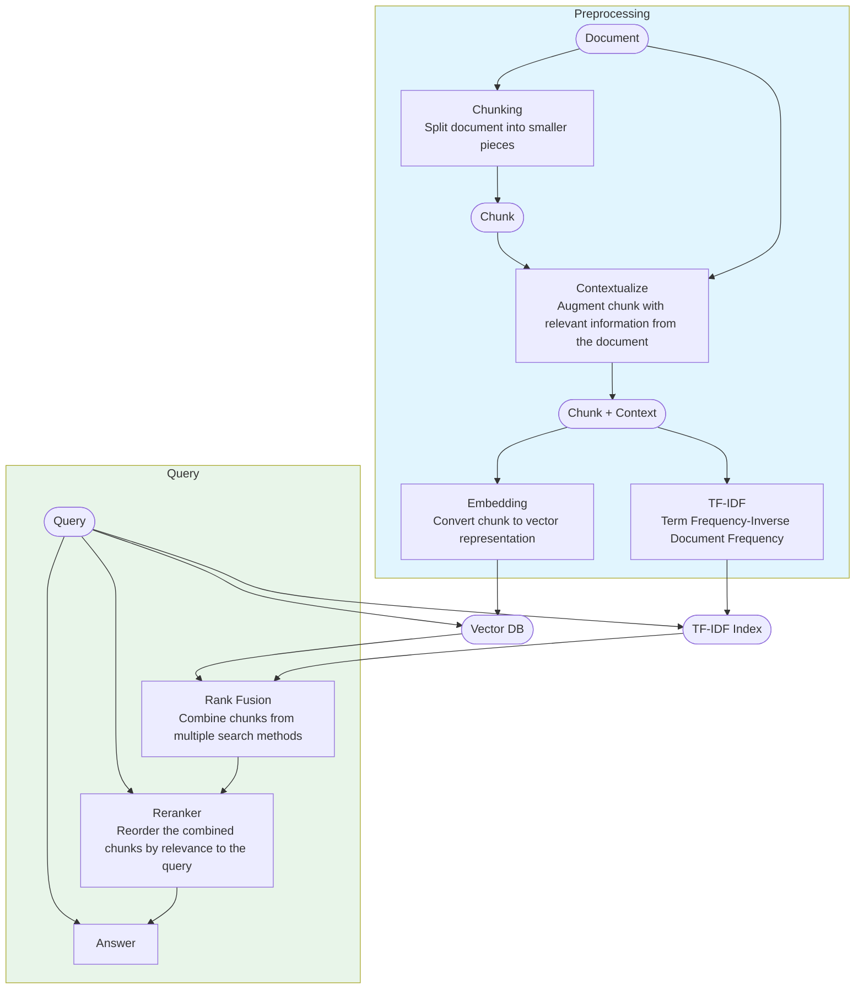

# RAG Lessons
- Chunking Strategies
    - Character-based: reliable as there is no need to understand the text, but may split text in unexpected places
    - Sentence-based: more reliable for plain text than character-based, but less suitable for other formats
    - Section-based: requires understanding the document structure and assumes consistent formatting

- Similarity can be measured with the cosine similarity metric. Values closer to 1 indicate the vectors are more similar and values closer to -1 indicate the vectors are dissimilar. Cosine distance is 1 minus the cosine similarity, so it's just shifted by 1, meaning that similar vectors have values close to 0.

## RAG Pipeline
