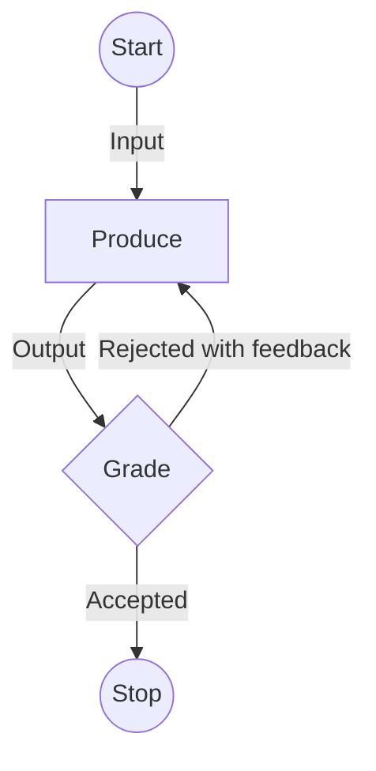
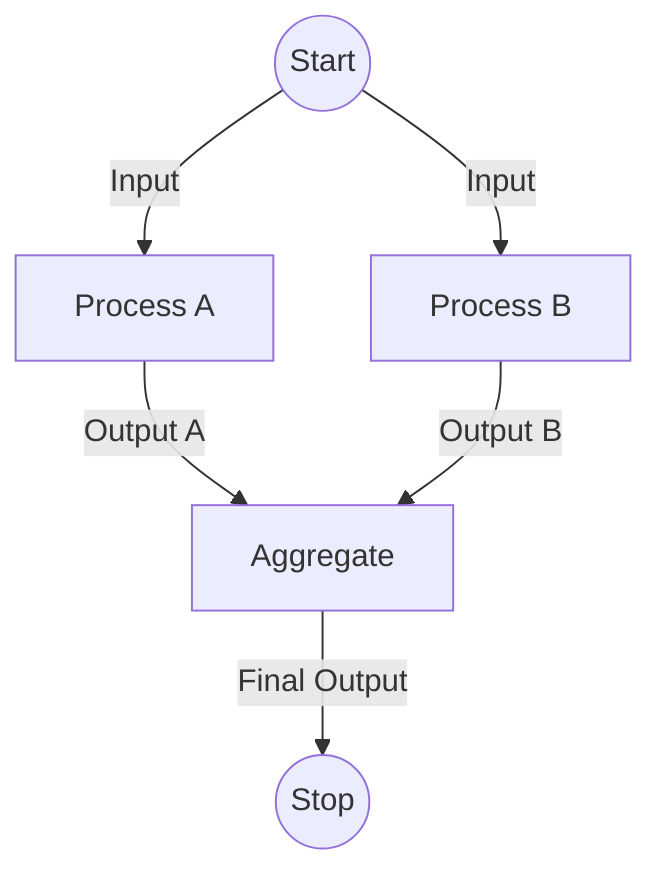
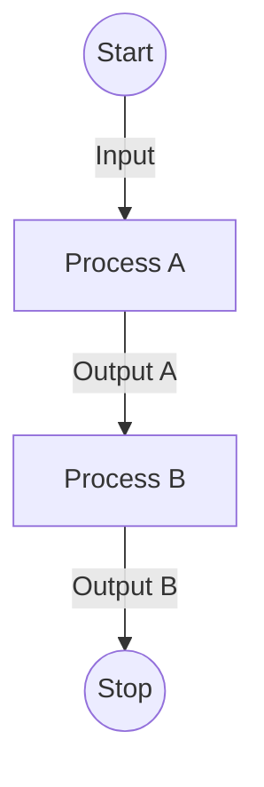
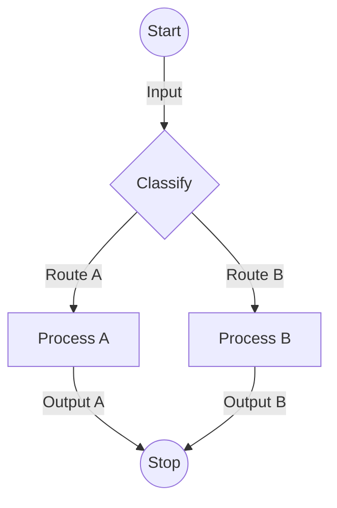

# Agent and Workflows

## Evaluator-Optimizer Workflow Pattern

- A producer creates an output
- A grader evaluates the output against the criteria and either accepts it or rejects it with feedback

## Parallelization

Instead of having a single large prompt that contains multiple criteria, it can be split into multiple smaller prompts that can be processed in parallel and aggregated at the end.

## Chaining

Similar to parallelization, this approach breaks large tasks into smaller steps, but processes them sequentially instead of in parallel.

## Routing

The input is first classified into a category and then forwarded to a pipeline with category-specific prompts and tools.

